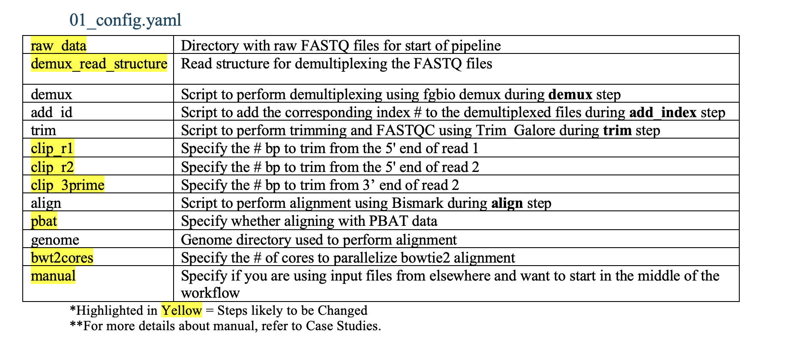
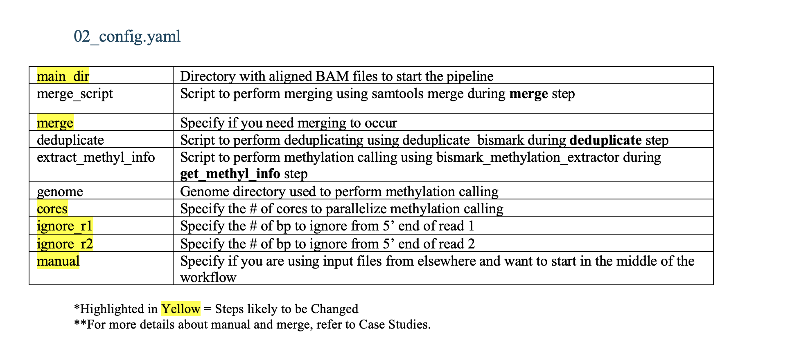

# Pipeline for Analyzing DNA Methylation


## **Introduction**

<details>
<summary><b>Pipeline Overview</b></summary>
<br>
This pipeline consists of 2 Snakemake workflows. 

<br>

**1. Preprocessing Workflow**: 

    Input: PE sequencing data 
    1. Demultiplex + Adding Index (fgbio DemuxFastqs)
    2. Trim (trim galore)
    3. Align (bismarck)

**2. Methylation Calling Workflow**: 

    Input: aligned bam 
    1. Merge (by sample across sequencing runs if desired) 
    2. Deduplicate (deduplicate_bismarck)
    3. Extract methylation info (bismarck_methylation_extractor )

<br><br>
This workflow was developed by Emily Chao, using Ruslan Stroganov's scripts as the template. 
<br><br>
If you want to know in detail how this workflow was created, click [here.](https://ohsuitg-my.sharepoint.com/:w:/r/personal/chaoe_ohsu_edu/Documents/Snakemake%20AML_CLOCK%20Workflow.docx?d=w9bad47d42fa34591afd6967842272001&csf=1&web=1&e=B5pnh6)


If you do not have access to this document, please email Emily Chao (chaoe@arc.ohsu.edu). 

I **HIGHLY** recommend using this document to guide you if you're a first time user. The instructions there are way more in-depth with thorough explanations. 

</details>


<details>
<summary><b> Getting Started</b></summary>
<br>
1. Pull all files from repository: 

```
srun --time=2:00:00 --mem=20G --partition=interactive --pty /usr/bin/bash -A [account]

cd /home/exacloud/gscratch/CEDAR/[user]
git clone https://github.com/ohsu-cedar-comp-hub/AMLClock.git
cd AMLClock
```

Run ```tree``` to ensure you have all the neccessary files. 
Your output should look like this: 
```
.
├── EXAMPLE_INPUT
│   ├── SampleSheets
│   │   └── S1_SampleSheet.csv
│   ├── data_S1_R1.fastq.gz
│   └── data_S1_R2.fastq.gz
├── README.md
├── Snakefile
├── aml_clock.yaml
├── assets
│   ├── cluster_breakdown.png
│   └── config_breakdown.png
├── config
│   ├── cluster
│   │   └── config.v8+.yaml
│   └── config.json
└── scripts
    ├── add_id.sh
    ├── align.sh
    ├── fg_demux.sh
    └── trim.sh

```

2. Set up the conda environment. 
```
conda env create -f aml_clock.yaml
conda activate aml_clock
cd AMLClock
```

</details>

## **Running Preprocessing Workflow**

<details>
<summary><b>From the Start</b></summary>
<br>

1. Organize input data accordingly. 

    Input data must be paired-end sequencing data ending with *_R1.fastq.gz and *_R2.fastq.gz. 
    The filename of the input data must also include an \_S#\_ somewhere aka the sample id. This is essential to match up with the expected sample sheet. All input data must be placed in a folder. 

    You must also have sample sheets to indicate which sample barcodes are expected per sample ID after demultiplexing. Sample sheets should follow the naming scheme of S#_SampleSheet.csv and placed in a SampleSheets directory inside your input data folder. 
    The content of the sample sheet must follow fgbio's guidelines: https://fulcrumgenomics.github.io/fgbio/tools/latest/DemuxFastqs.html. 
    
    NOTE: There is one key addition to the sample sheet: SAMPLE_INDEX. This was added to help with identifying files and each index is unique per sample name. 

    **A full example is in the EXAMPLE_INPUT directory.**
    <br>
    <br>

    **NOTE:** If you have files ending in *\_R1_\{something}.fastq.gz, you can use change_ext.sh located in the scripts/ to change it to the desired format. *_R1.fastq.gz. This script gets rid of the {something} so if you still wanted to keep it, put it manually in file name/use a different script. 

    ```
    ./scripts/change_ext.sh --d=[absolute path to input data directory]

    ```

<br>

2. Navigate to config/01_config.json. You will need to change the variables to match what you need. 
    
    These are the variables you **must** change and their required values: 
    1. **raw_data: [absolute path to input data directory]**
    2. **manual: false**

    You will also likely need to change the other variables as it is dependent on the parameters you would like to use for the demultiplexing, trimming and aligning.
    
    Refer to [Config File Breakdown](#config-file-breakdown) for more details. 

<br>

3. Navigate to config/cluster/config.v8+.yaml. 
    
    You can change the variables as needed. Most often, you may want to change the slurm account, where the output logs are going to and how the slurm jobs are named. 

    If desired, you can also change the default resources. 
    You are also able to change the resource requests per rule in the smk file. More details in [another section]. 

    Refer to Cluster Config File Breakdown [Cluster Config File Breakdown](#cluster-config-file-breakdown) for more details. 

<br>

4. Perform a Snakemake dry run to confirm that your data will be ran correctly. 
    ```
    cd AMLClock
    configfile=[absolute path to 01_config.json]
    snakefile=[absolute path to 01_preprocessing.smk]

    snakemake -n –-profile config/cluster/ --configfile=$configfile -s $snakefile 
    ```

    Pay close attention to the output of this dry run and check that the files Snakemake is expected to generate are correct. 

<br>

6. Now run this workflow using the launch script `scripts/run_pipeline.sh` 
    ```
    cd AMLClock
    sbatch scripts/run_pipeline.sh -c $configfile -s $snakefile

    ```


**NOTE:** If you want to run the workflow from the start, but end earlier, you would be looking to customize like this: 

```
cd AMLClock

snakemake -n –-profile config/cluster/ --configfile=$configfile -s $snakefile --until [last rule to run]

sbatch scripts/run_pipeline.sh -c $configfile -s $snakefile -u [last rule to run]

```

7. Check and monitor the workflow's progress. 

You can see how the overall workflow is proceeding by going to slurm-[sbatchjobid].out

You can see individual job progress by going to the output directory you had set in config/cluster/config.v8+.yaml. 

</details>


<details>
<summary><b>From the Middle</b></summary>
<br>

This is for when you want to run the preprocessing workflow mid-way and you do not have the files produced from the first step (demultiplexing) because they are elsewhere/not available to you. 

For this workflow, there are 2 possible scenarios: 
1. I have files demultiplexed (w/ or w/o index) that needs trimming and alignment. 
2. I have files trimmed that need alignment. 

I will address both below: 

1. Prepare your input. 
    
    Your input must match the format of the rule that you are trying to start from. 

    Start from **trim**: 

    - Input files must be in [input dir]/Demuxed. 

    - Input files must end in: *_R1.fastq.gz , *_R2.fastq.gz

    - **NOTE:** If your demuxed file name has no index and you don't have a sample sheet in hand, you will need to manually add in an index where it should be *_{INDEX}_R1.fastq.gz and \*\_{INDEX}_R2.fastq.gz. 
        Your index should be unique per sample name. So, files with the same sample name should have the same sample index. 
 

    Start from **align**: 

    - Input files must be in [input dir]/Trimmed. 

    - Input files must end in: *_R1_val_1.fq.gz , *_R2_val_2.fq.gz 

<br>

2. Adjust your config file in config/01_config.json as needed. 

    These are the variables you **must** change and their required values: 
    1. **raw_data: [absolute path to input dir]**
    2. **manual: true**

    Feel free to adjust the other parameters as desired for your trimming and/or aligning. 

    Refer to [Config File Breakdown](#config-file-breakdown) for more details. 

<br>

3. Adjust your cluster config file in config/cluster/config.v8+.yaml as needed. 
    If desired, you can also change the default resources. 
    You are also able to change the resource requests per rule in the smk file. More details in [Changing Resource Requests](#Changing-Resource-Requests). 

    Refer to Cluster Config File Breakdown [Cluster Config File Breakdown](#cluster-config-file-breakdown) for more details. 

4. Run dry run now. 

    ```
    cd AMLClock
    snakefile=[absolute path to 01_preprocessing.smk]
    configfile=[absolute path to 01_config.json]
    snakemake -n –-profile config/cluster/ --configfile=$configfile -s $snakefile 
    ```

    Pay close attention to the output snakemake generates. You should see that the rules snakemake would run are the remaining rules you need. 

<br>

4. Run the workflow now. 

    ```
    cd AMLClock
    snakefile=[absolute path to 01_preprocessing.smk]
    configfile=[absolute path to 01_config.json]
    sbatch scripts/run_pipeline.sh -c $configfile -s $snakefile

    ```
5. Check and monitor the workflow's progress. 
You can see how the overall workflow is proceeding by going to slurm-[sbatchjobid].out
You can see individual job progress by going to the output directory you had set in config/cluster/config.v8+.yaml. 

</details>

## **Running the Methylation Calling Workflow**

<details>
<summary><b>From the Start</b></summary>
<br>
This workflow is very similar to the Preprocessing Workflow. 

1. Organize input data accordingly. 

    Input data must be aligned bam data ending with *_R1_val_1_bismark_bt2_pe.bam. 
    
<br>

2. Navigate to config/02_config.json. You will need to change the variables to match what you need. 
    
    These are the variables you **must** change and their required values: 
    1. **main_dir: [absolute path to input data directory]**
    2. **manual: false**
    3. **merge: true OR false**

    NOTE: You will specify whether you want merging to occur here. Merging occur before deduplication and extraction methylation informtion. It will merge by sample name and sample index and will return {sample_name}_{sample_index}_R1_val_1_bismark_bt2_pe.bam. 

    You will also likely need to change the other variables as it is dependent on the parameters you would like to use for the deduplicating and extracting methylation information. Refer to [Config File Breakdown](#config-file-breakdown) for more details. 

    **NOTE:** If you are running this workflow right after running the preprocessing workflow, your config[main_dir] = [absolute path to Aligned_paired directory]

<br>

3. Navigate to config/cluster/config.v8+.yaml. 
    
    You can change the variables as needed. Most often, you may want to change the slurm account, where the output logs are going to and how the slurm jobs are named. 

    If desired, you can also change the default resources. 
    You are also able to change the resource requests per rule in the smk file. More details in [Changing Resource Requests](#Changing-Resource-Requests). 

    Refer to Cluster Config File Breakdown [Cluster Config File Breakdown](#cluster-config-file-breakdown) for more details. 

<br>

4. Perform a Snakemake dry run to confirm that your data will be ran correctly. 
    ```
    cd AMLClock
    configfile=[absolute path to 02_config.json]
    snakefile=[absolute path to 02_methylation_calling.smk]

    snakemake -n –-profile config/cluster/ --configfile=$configfile -s $snakefile 
    ```

    Pay close attention to the output of this dry run and check that the files Snakemake is expected to generate are correct. 

<br>

6. Now run this workflow using the launch script `scripts/run_pipeline.sh` 
    ```
    cd AMLClock
    sbatch scripts/run_pipeline.sh -c $configfile -s $snakefile

    ```

NOTE: If you want to run the workflow from the start, but end earlier, you would be looking to customize like this: 

```
cd AMLClock

snakemake -n –-profile config/cluster/ --configfile=$configfile -s $snakefile --until [last rule to run]

sbatch scripts/run_pipeline.sh -c $configfile -s $snakefile -u [last rule to run]

```

7. Check and monitor the workflow's progress. 
You can see how the overall workflow is proceeding by going to slurm-[sbatchjobid].out
You can see individual job progress by going to the output directory you had set in config/cluster/config.v8+.yaml. 

</details>


<details>
<summary><b>From the Middle</b></summary>
<br>

This is for when you want to start running the methylation calling workflow mid-way. 

The only way this would occur for this workflow is for when you have deduplicated files but do not have your aligned files. 


**Example**: I have output files that have been deduplicated. I only need to extract methylation information from them. 

1. Prepare your input. 

    Start from **deduplicate**: 

    - Input files must be in [input dir]/Deduplicated. 

    - Input files must end in: *_R1_val_1_bismark_bt2_pe.deduplicated.bam. 

<br>

2. Adjust your config file in config/02_config.json as needed. 

    These are the variables you **must** change and their required values: 
    1. **main_dir: [absolute path to input dir]**
    2. **manual: true** 
    3. **merge: false**

    Feel free to adjust the other parameters as desired for methylation calling. 

    Refer to [Config File Breakdown](#config-file-breakdown) for more details. 

<br>

3. Adjust your cluster config file in config/cluster/config.v8+.yaml as needed. 
    
    If desired, you can also change the default resources. 
    You are also able to change the resource requests per rule in the smk file. More details in [Changing Resource Requests](#Changing-Resource-Requests). 

    Refer to Cluster Config File Breakdown [Cluster Config File Breakdown](#cluster-config-file-breakdown) for more details. 

4. Run dry run now. 

    ```
    cd AMLClock
    snakefile=[absolute path to 02_preprocessing.smk]
    configfile=[absolute path to 02_config.json]
    snakemake -n –-profile config/cluster/ --configfile=$configfile -s $snakefile 
    ```

    Pay close attention to the output snakemake generates. You should see that the rules snakemake would run are the remaining rules you need. In this case, it should only run all and get_methyl_info rules. 

<br>

4. Run the workflow now. 

    ```
    cd AMLClock
    snakefile=[absolute path to 02_preprocessing.smk]
    configfile=[absolute path to 02_config.json]
    sbatch scripts/run_pipeline.sh -c $configfile -s $snakefile

    ```
5. Check and monitor the workflow's progress. 
You can see how the overall workflow is proceeding by going to slurm-[sbatchjobid].out
You can see individual job progress by going to the output directory you had set in config/cluster/config.v8+.yaml. 

</details>


## Config File Breakdown 

Use this breakdown to help determine which variables you would want to customize: 





## Cluster Config File Breakdown 

Use this breakdown to help determine which variables you would want to customize: 


## Changing Resource Requests 

The default resource requests can be seen by going to the cluster config file. 

The breakdown is here: [Cluster Config File Breakdown](#cluster-config-file-breakdown). 

I've chosen the default and some rule-specific manual adjustments through some experimenting with small UKCTOCs samples. 
For the full explanation go [here.](https://ohsuitg-my.sharepoint.com/:w:/r/personal/chaoe_ohsu_edu/Documents/Snakemake%20AML_CLOCK%20Workflow.docx?d=w9bad47d42fa34591afd6967842272001&csf=1&web=1&e=B5pnh6)

I've also manually adjusted the resource requests for some big rules in the smk files. To take a look, go to the smk file. 
For preprocessing workflow, it will be 01_preprocessing.smk. 
For methylation calling workfliw, it will be 02_methylation_calling.smk. 


If you want to do any resource adjusting, I suggest you adjust it manually first, before trying to change the defaults. 

To do so: 
1. Navigate to the relevant smk file. 
2. Look for rule [target_rule] in the code. You can see if there are any parameters for resources by looking for: 
- threads: (specifies # of CPUs) 
- resources: (specifies time, mem_mb, gres etc. )
3. Feel free to adjust your resource requests by modifying the number in threads and the values in resources. 
    If there are no 'threads:' or 'resources:' present under your target rule, you can add them. 
    **Example:**
    rule target: 
        input: ..
        output: ..
        params: ..
        threads: 1
        resources: 
            time="04:00:00",
            gres="disk:1024", 
            mem_mb=4000  


Want to know if your resource requests were good? Refer to the SlurmJobAssessment tool [here](https://github.com/ohsu-cedar-comp-hub/SlurmStats)

