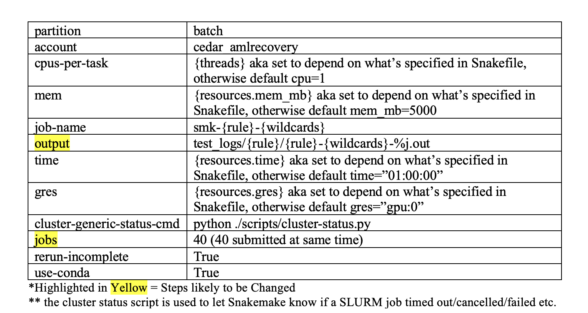

# Snakemake Workflow for Analyzing DNA Methylation


## Background
This workflow starts with sequencing data and performs demultiplexing, trimming and aligning. Demultiplexing is performed using fgbio DemuxFastqs, trimming is done via trim galore and alignment is done via Bismarck. 
From there, users can do further analysis like deduplication and extracting methylation information using scripts such as deduplicate_bismarck and bismarck_methylation_extractor. 
<br><br>
This workflow was developed by Emily Chao, using Ruslan Stroganov's scripts as the template. 
<br><br>
If you want to know in detail how this workflow was created, click [here.](https://ohsuitg-my.sharepoint.com/:w:/r/personal/chaoe_ohsu_edu/Documents/Snakemake%20AML_CLOCK%20Workflow.docx?d=w9bad47d42fa34591afd6967842272001&csf=1&web=1&e=B5pnh6)


If you do not have access to this document, please email Emily Chao (chaoe@arc.ohsu.edu). 

I **HIGHLY** recommend using this document to guide you if you're a first time user. The instructions there are way more in-depth with thorough explanations. 


## Getting Started
1. Pull all files from repository: 

```
srun --time=2:00:00 --mem=20G --partition=interactive --pty /usr/bin/bash

cd /home/exacloud/gscratch/CEDAR/[user]
git clone https://github.com/ohsu-cedar-comp-hub/AMLClock.git
cd AMLClock
```

Run ```tree``` to ensure you have all the neccessary files. 
Your output should look like this: 
```
.
├── EXAMPLE_INPUT
│   ├── SampleSheets
│   │   └── S1_SampleSheet.csv
│   ├── data_S1_R1.fastq.gz
│   └── data_S1_R2.fastq.gz
├── README.md
├── Snakefile
├── aml_clock.yaml
├── assets
│   ├── cluster_breakdown.png
│   └── config_breakdown.png
├── config
│   ├── cluster
│   │   └── config.v8+.yaml
│   └── config.json
└── scripts
    ├── add_id.sh
    ├── align.sh
    ├── fg_demux.sh
    └── trim.sh

```

2. Set up the conda environment. 
```
conda env create -f aml_clock.yaml
conda activate aml_clock

```

## Running the Workflow from the Start
1. Organize input data accordingly. 

    Input data must be paired-end sequencing data ending with *.fastq.gz. In the file names of the input data, there must be an 'S#' somewhere aka the sample id. This is essential to match up with the expected sample sheet. All input data must be placed in a folder inside the aml_clock folder. 

    You must also have sample sheets to indicate which sample barcodes are expected per sample ID after demultiplexing. Sample sheets should follow the naming scheme of S#_SampleSheet.csv and placed in a SampleSheets directory inside your input data folder. 

    An example is in the EXAMPLE_INPUT directory. 

<br>

2. Navigate to config/config.json. You will need to change the variables to match your absolute path. 

    You will also likely need to change the other variables as it is dependent on the parameters you would like to use for the demultiplexing, trimming and aligning. Refer to [Config File Breakdown](#config-file-breakdown) for more details. 

    Make sure that **manual is set to false** here. It only needs to be true if you're starting the workflow from the middle. 

<br>

3. Navigate to config/cluster/config.v8+.yaml. You can change the variables as needed. Refer to Cluster Config File Breakdown [Cluster Config File Breakdown](#cluster-config-file-breakdown) for more details. 

<br>

4. Perform a Snakemake dry run to confirm that your data will be ran correctly. 
    ```
    configfile=[absolute path to config.json]
    snakemake -n –profile config/cluster/ --configfile=$configfile 
    ```

    Pay close attention to the output of this dry run and check that the files Snakemake is expected to generate are correct. 

<br>

6. Now run this workflow using the launch script `scripts/run_pipeline.sh` 
    ```
    sbatch scripts/run_pipeline.sh -c $configfile 

    ```


NOTE: If you want to run the workflow from the start, but end earlier, you would be looking to customize like this: 

```
configfile=[absolute path to config.json]
snakemake -n –-profile config/cluster/ --configfile=$configfile --until [last rule to run]

sbatch scripts/run_pipeline.sh -c $configfile -u [last rule to run]

```

## Running the Workflow from the Middle 
This is for when you want to run the workflow mid-way and you do not have the files produced from the first step (demultiplexing) and earlier steps because they are elsewhere/not available to you. 
A perfect case example is: I have output files that have been trimmed. I want to just align them via bismarck. 

1. Prepare your input. 
    
    For whatever your input will be, it must match the format of the rule that you are trying to start from. 

    Start from **trim**: 

    Input files must be in [input dir]/Demuxed. 

    Input files must end in: *_R1.fastq.gz , *_R2.fastq.gz

    Start from **align**: 

    Input files must be in [input dir]/Trimmed. 

    Input files must end in: *_R1_val_1.fq.gz  , *_R2_val_2.fq.gz 

<br>

2. Adjust your config file in config/config.json as needed. You **MUST** set manual to true here. 

<br>

3. Run dry run now. 

    ```
    configfile=[absolute path to config.json]
    snakemake -n –-profile config/cluster/ --configfile=$configfile 
    ```

<br>

4. Run the workflow now. 

    ```
    sbatch scripts/run_pipeline.sh -c $configfile 

    ```

## Config File Breakdown 

Use this breakdown to help determine which variables you would want to customize: 


## Cluster Config File Breakdown 

Use this breakdown to help determine which variables you would want to customize: 



